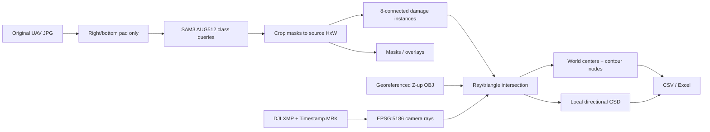

# Architecture

## 중요한 경계

- 탐지 mask의 유일한 좌표계는 원본 JPG pixel grid입니다.
- padding 영역의 예측은 crop되어 정량화와 Ray 계산에 들어가지 않습니다.
- 각 class mask는 독립 Boolean mask입니다. 중첩 pixel을 argmax로 버리지 않습니다.
- 3D 절대좌표는 MRK/XMP pose와 EPSG:5186 OBJ가 동시에 있어야 생성됩니다.
- 모델은 run마다 한 번, OBJ 가속구조도 run마다 한 번만 로드합니다.
